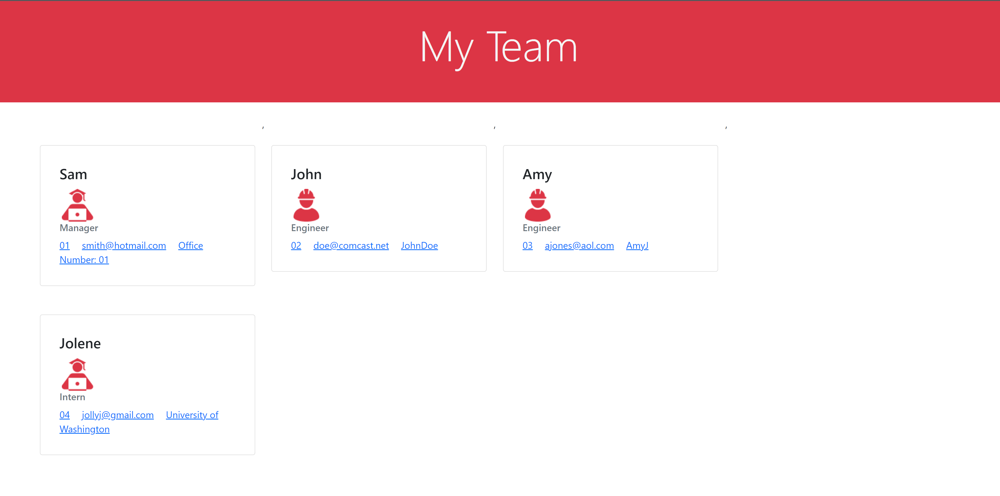

# Team Generator

## Description 
A node application that allows the user to generate an html that would display all their team members information off of information given by the user.

## Table of Contents
* [Description](#description)
* [Instillation](#instillation)
* [Usage](#usage)
* [Contribution](#contribution)
* [Tests](#tests)
* [Questions](#questions)
## Instillation 
The user needs to have node installed on their computer, this code has inquirer and jest dependencies
## Usage 
The user would launch "node index.js" and then answer a series of questions. Once they have created enough team members they would click done to then create the html file. This index.html file would then be used as they pleased

A link to the google drive video of the application: https://drive.google.com/file/d/1T52yRCpq4tSvQYXEN2I7Jxl8LHmSe_sc/view?usp=sharing
    
## Contribution
There are no contribution guidelines for this project
## Tests
This application has a folder of tests that rely on jest for each individual class. To run the test simply install jest and then launch "npm run test"
 
## Liscense
This is free and unencumbered software released into the public domain. Anyone is free to copy, modify, publish, use, compile, sell, or distribute this software, either in source code form or as a compiled binary, for any purpose, commercial or non-commercial, and by any means. In jurisdictions that recognize copyright laws, the author or authors of this software dedicate any and all copyright interest in the software to the public domain. We make this dedication for the benefit of the public at large and to the detriment of our heirs and successors. We intend this dedication to be an overt act of relinquishment in perpetuity of all present and future rights to this software under copyright law. THE SOFTWARE IS PROVIDED 'AS IS', WITHOUT WARRANTY OF ANY KIND, EXPRESS OR IMPLIED, INCLUDING BUT NOT LIMITED TO THE WARRANTIES OF MERCHANTABILITY, FITNESS FOR A PARTICULAR PURPOSE AND NONINFRINGEMENT. IN NO EVENT SHALL THE AUTHORS BE LIABLE FOR ANY CLAIM, DAMAGES OR OTHER LIABILITY, WHETHER IN AN ACTION OF CONTRACT, TORT OR OTHERWISE, ARISING FROM, OUT OF OR IN CONNECTION WITH THE SOFTWARE OR THE USE OR OTHER DEALINGS IN THE SOFTWARE. For more information, please refer to https://unlicense.org

## Questions
If you have any further questions contact me here:
 - Email simona.snapk@gmail.com
 - GitHub [SimonaSnap](https://github.com/SimonaSnap)

